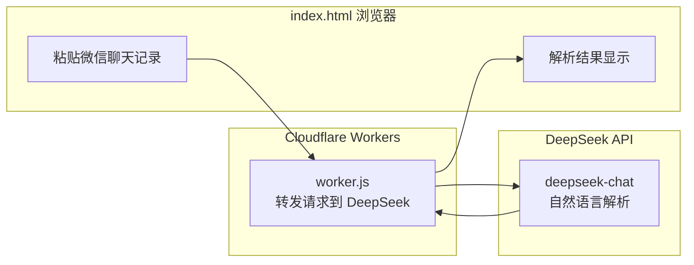
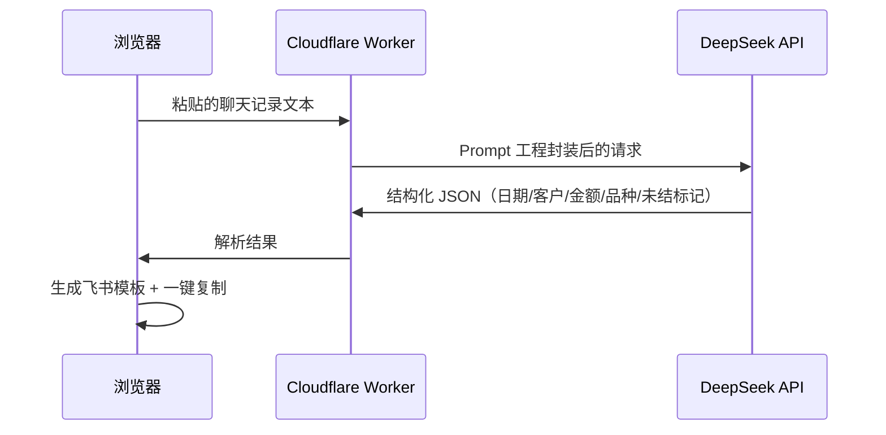

# 架构图 · 育苗场记账助手

## 整体架构

## 数据流

## 关键架构决策

| 决策 | 原因 |
|------|------|
| API Key 放 Worker 而非前端 | 前端直连会暴露 Key；Cloudflare Worker 服务端持有，浏览器只调 Worker |
| 本地 localStorage 记忆 | 误关页面可恢复，无后端数据库 |
| 两种模式分离 | 记账（收支）和订单（品种/数量/出苗时间）字段不同，分开 Prompt 更准 |
| 日期批量设置 | 家人经常忘写日期，一键补全 |
