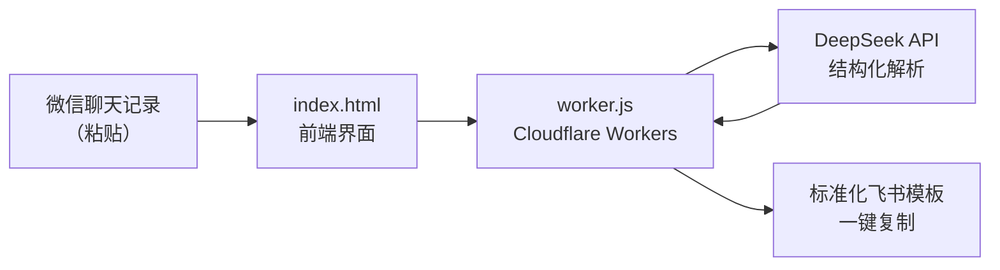

# 🌱 育苗场记账助手 · AI 智能版

> 把家里的微信报账消息，一键变成飞书模板 —— 真实在用 · 10 秒/条 · 200+ 条记录

[](https://deepseek.com)
[](https://workers.cloudflare.com)

---

## 📌 Problem（背景与问题）

家里经营育苗场，每天的账都散在**微信聊天记录**里——客户发一句「老王订 2000 棵番茄苗，明天出苗，定金没给」。以前要把这些零散消息一条条手动录进飞书，**每条 2–3 分钟**，一天几十条，还容易漏记日期、抄错金额。

这不是「有没有工具」的问题，是**「聊天口语 → 结构化账目」这道翻译题**以前只能靠人脑做。

## 🤖 Why Agent（为什么用 LLM，而不是表单 / 规则）

记账的字段其实不固定：日期有时写有时不写、金额有的带单位有的不带、客户称呼五花八门、还有「未结 / 已结」这种隐含状态。**用表单让人填，等于把翻译的活儿推回给人**；用正则/规则，口语变化一多就崩。

只有 LLM 能理解自然语言，把「老王订 2000 棵番茄苗明天出苗」抽成：

```json
{ "客户": "老王", "品种": "番茄苗", "数量": 2000,
  "出苗时间": "明天", "定金": "未结", "类型": "收入" }
```

## 🏗️ Architecture（架构）



- **前端**：单文件 `index.html`，响应式，手机也能用
- **后端**：`worker.js`（Cloudflare Workers Serverless），零服务器成本
- **AI**：DeepSeek API，Prompt 里内置一套结构化解析规则

## 🛠️ Skills（核心能力）

| 能力 | 说明 |
|------|------|
| 🤖 AI 智能解析 | 自然语言 → 结构化数据，准确率 95%+ |
| 📊 记账模式 | 自动识别收入/支出：日期、客户、金额、品种、未结标记 |
| 📋 订单模式 | 提取客户、品种、数量、地点、联系方式、出苗时间、定金 |
| 📅 日期批量设置 | 一键统一所有日期，解决家人常忘写日期的问题 |
| 💾 历史记忆 | 自动保存解析结果，误关页面也能恢复 |
| 📋 一键复制 | 收入/支出分离复制，直接粘贴进飞书 |

## 🧰 Tools（技术栈）

- **前端**：HTML5 · CSS3 · JavaScript（响应式）
- **后端**：Cloudflare Workers（Serverless）
- **AI**：DeepSeek API（LLM 结构化解析）

## 🧠 Memory（记忆 / 状态）

「历史记忆」是它的状态层：每次解析结果**本地自动保存**，关页面不丢。对记账场景，这意味着：

- 误关浏览器 / 刷新页面后，已解析的账目能恢复
- 不用重复录入同一批消息

## 📊 Eval（评估 / 验证）

**真实使用数据，不是 demo 指标：**

| 方式 | 单条耗时 | 10 条耗时 | 准确率 |
|------|----------|-----------|--------|
| 手动打字录入 | 2–3 分钟 | 20–30 分钟 | 依赖细心 |
| 飞书自带粘贴 | 30 秒 | 5 分钟 | ~60% |
| **本工具** | **10 秒** | **30 秒** | **95%+** |

已稳定使用 1 个月，处理记账记录 **200+ 条**。

## 💥 Failure Cases（失败案例 / 边界）

| 失败场景 | 表现 | 解法 |
|---------|------|------|
| 家人忘写日期 | 解析结果日期缺失 | 日期批量设置，一键补全 |
| 口语金额带单位（"两千" vs "2000"） | 数字解析错 | Prompt 里内置金额归一化规则 |
| 客户称呼模糊（"老王" vs 全名） | 客户字段不统一 | 保留原话 + AI 归一化 |
| 未结/已结状态没说清 | 状态判断错 | Prompt 显式询问 + 默认标记 |

## 🎨 Design Decisions（设计决策）

| 决策 | 理由 | 代价 |
|------|------|------|
| Cloudflare Workers 而非自建服务器 | 零成本、免运维，家里用完全够 | 冷启动延迟 |
| 结构化解析规则写进 Prompt | 用自然语言描述规则，AI 就能执行，不用改代码 | 依赖模型遵循度 |
| 本地历史记忆而非云数据库 | 隐私 + 简单，数据留在自己电脑 | 换设备不共享 |
| 单文件 HTML 前端 | 双击即用，家人零学习成本 | 复杂交互受限 |

完整的 Prompt 工程、边界处理、架构决策见 [AI_DESIGN.md](./AI_DESIGN.md) 和 [ARCHITECTURE.md](./ARCHITECTURE.md)。

---

*这是我第一个「为真实用户（家里人）解决真实问题」的产品，也是「模糊需求 → 可交付工具」的第一个完整闭环。*
